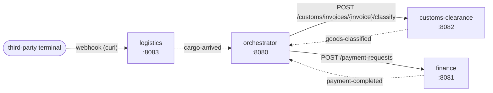

# Event-driven import process

Demo with an orchestrator and three Spring Boot microservices (Spring Boot 4.1 / Java 21). Each microservice has a
closed domain and its own API; the orchestrator follows the import process workflow by reacting to events.



Solid arrows are REST calls. Dotted arrows are internal Spring events that the event-bridge library of each
service turns into `POST /events` on the orchestrator.

- **event-bridge** (library): listens to internal Spring events (`ApplicationEventPublisher`) that implement
  `IntegrationEvent` and sends them to the orchestrator at `POST /events`, with retries. It switches itself on when
  `event-bridge.orchestrator-url` is set.
- **orchestrator**: receives the events and drives the process. When the cargo arrives, it asks **in parallel** for
  the classification of the invoice (customs clearance, ~8s) and the opening of the terminal charges payment
  (finance, ~3s). The payment finishes first; when the classification finishes too, the orchestrator records the
  completion.

## Run

```
docker compose up --build
```

To follow only the orchestrator (receiving the events and narrating the workflow):

```
docker compose logs -f orchestrator
```

## Trigger the process

Cargo arrival webhook (simulates the notice from a third-party terminal):

```
curl -X POST http://localhost:8083/webhooks/terminal/cargo-arrival -H "Content-Type: application/json" --data-binary "@examples/logistics-cargo-arrival.json"
```

In PowerShell use `curl.exe` (`curl` is an alias of `Invoke-WebRequest`). Then check the process:

```
curl http://localhost:8080/processes
```

## APIs

Each service has one `GET` and two `POST` endpoints, with its own vocabulary. Sample payloads are in
[examples/](examples/).

| Service                       | Method and route                                 | What it does                                       |
| ----------------------------- | ------------------------------------------------ | -------------------------------------------------- |
| **orchestrator** `:8080`      | `POST /events`                                   | receives the events sent by the event-bridge       |
|                               | `GET /processes`, `GET /processes/{id}`          | status and history of the processes                |
| **finance** `:8081`           | `POST /payment-requests`                         | opens a payment request (pays itself after ~3s)    |
|                               | `POST /payment-requests/{id}/cancellation`       | cancels it while still open (otherwise 409)        |
|                               | `GET /payment-requests/{id}`                     | gets the payment request                           |
| **customs-clearance** `:8082` | `POST /customs/invoices/{invoice}/classify`      | classifies the goods (takes ~8s)                   |
|                               | `POST /customs/invoices/{invoice}/amend-hs-code` | corrects the HS code of an already classified item |
|                               | `GET /customs/invoices/{invoice}/classification` | gets the classification                            |
| **logistics** `:8083`         | `POST /shipments`                                | registers the shipment of an ocean cargo           |
|                               | `POST /webhooks/terminal/cargo-arrival`          | arrival notice; **triggers the process**           |
|                               | `GET /tracking/{container}`                      | position and history of the cargo                  |

To see the process get interrupted: fire the webhook and, within 3s, cancel the payment
(`POST /payment-requests/PR-0001/cancellation`, body in `examples/finance-cancel-payment-request.json`).

## Notes

- The simulated delays can be tuned with the `SIMULATION_DELAY` variable in `docker-compose.yml`.
- All state is kept in memory; restarting a container wipes its data.
- Without Docker: `./mvnw package`, then `java -jar <module>/target/<module>.jar` for each module
  (the default URLs point to `localhost`).
