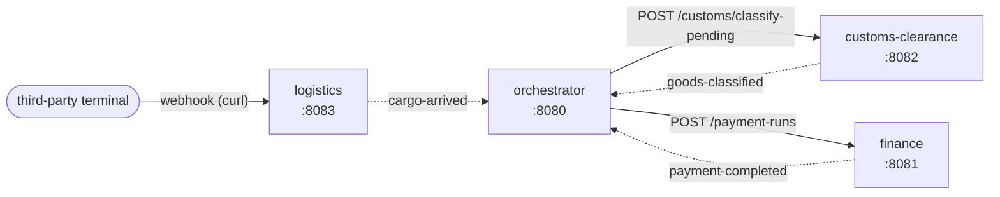

# Event-driven import process

Demo with an orchestrator and three Spring Boot microservices (Spring Boot 4.1 / Java 21). Each microservice owns its
domain, its data and its API, and does what it knows how to do. The orchestrator gives them the ability to **react**:
it listens to an event from one service and lets the next one know it can act. It never hands data from one service
to another.



Solid arrows are REST calls. Dotted arrows are internal Spring events that the event-bridge library of each
service turns into `POST /events` on the orchestrator.

- **event-bridge** (library): listens to internal Spring events (`ApplicationEventPublisher`) that are an
  `IntegrationEvent` and sends them to the orchestrator at `POST /events`, with retries. It switches itself on when
  `event-bridge.orchestrator-url` is set.
- **orchestrator**: when the cargo arrives, it tells customs clearance and finance, in parallel and without any
  payload, that they can act. Each one then looks for its own pending work: customs clearance classifies the invoices
  pending classification (~8s) and finance pays the pending payment requests (~3s). The payment finishes first; when
  the classification finishes too, the orchestrator records the completion. The events of one process are tied
  together by their correlation id, which is the invoice number.

### Publishing an event

A service only needs the library, the orchestrator URL and one line. There is no event class to define:

```yaml
event-bridge:
  orchestrator-url: http://orchestrator:8080
```

```java
events.publishEvent(IntegrationEvent.of("customs.goods-classified", invoice));
```

The name identifies the step the orchestrator is waiting for. The correlation id (here the invoice number) ties the
event to its process. An optional payload is available too: `of(type)`, `of(type, correlationId)` and
`of(type, correlationId, data)`. The timestamp, the source application and the event id are added by the library.

## Run

```
docker compose up --build
```

To follow only the orchestrator (receiving the events and narrating the workflow):

```
docker compose logs -f orchestrator
```

## Run the scenario

Sample payloads are in [examples/](examples/). In PowerShell use `curl.exe` (`curl` is an alias of
`Invoke-WebRequest`).

1. Each service receives its own work, on its own:

```
curl -X POST http://localhost:8083/shipments -H "Content-Type: application/json" --data-binary "@examples/logistics-shipment.json"
curl -X POST http://localhost:8082/customs/invoices -H "Content-Type: application/json" --data-binary "@examples/customs-submit-invoice.json"
curl -X POST http://localhost:8081/payment-requests -H "Content-Type: application/json" --data-binary "@examples/finance-open-payment-request.json"
```

2. The terminal tells logistics that the container arrived. This triggers the process:

```
curl -X POST http://localhost:8083/webhooks/terminal/cargo-arrival -H "Content-Type: application/json" --data-binary "@examples/logistics-cargo-arrival.json"
```

3. Check the process:

```
curl http://localhost:8080/processes/XPTO-2026-0042
```

To run it again, use another container and invoice number in the sample files. If a service has nothing pending when
the orchestrator lets it know, it only logs that and the process keeps waiting for its event.

## APIs

Each service has one `GET` and two `POST` endpoints, with its own vocabulary.

| Service | Method and route | What it does |
|---|---|---|
| **orchestrator** `:8080` | `POST /events` | receives the events sent by the event-bridge |
| | `GET /processes`, `GET /processes/{invoice}` | status and history of the processes |
| **finance** `:8081` | `POST /payment-requests` | opens a payment request, which stays pending |
| | `POST /payment-runs` | pays the pending payment requests (takes ~3s) |
| | `GET /payment-requests/{id}` | gets the payment request |
| **customs-clearance** `:8082` | `POST /customs/invoices` | submits an invoice, which stays pending classification |
| | `POST /customs/classify-pending` | classifies the pending invoices (takes ~8s) |
| | `GET /customs/invoices/{invoice}` | gets the invoice and its classification |
| **logistics** `:8083` | `POST /shipments` | registers the shipment of an ocean cargo |
| | `POST /webhooks/terminal/cargo-arrival` | arrival notice from the terminal; **triggers the process** |
| | `GET /tracking/{container}` | position and history of the cargo |

## Notes

- The simulated delays can be tuned with the `SIMULATION_DELAY` variable in `docker-compose.yml`.
- All state is kept in memory; restarting a container wipes its data.
- Without Docker: `./mvnw package`, then `java -jar <module>/target/<module>.jar` for each module
  (the default URLs point to `localhost`).
